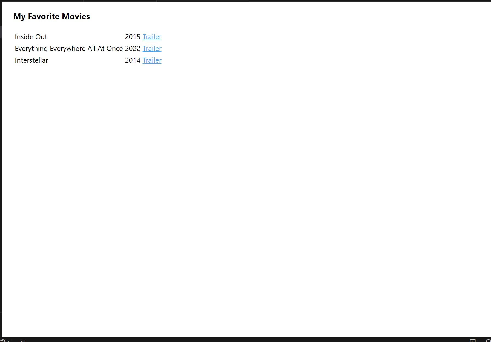

# More HTML

## Assignment: Create an webpage for your favorite movies

For this assignment you will create an html page that includes information about your favorite movies.

### Instructions
Add the following changes to your webpage:  
- Display 'My favorite Movies' at the top of the page with a header tag (h1, h2, or h3)  
- Display a table of your 3 favorite movies with a table tag (table)
  -  Display information about each movie in its own row with a table row tag (tr)  
     -  Display each movie's Title with a table-data tag (td)  
     -  Display each movie's Release Year with a table-data tag (td)  
     -  Display a link to each movie's trailer with an anchor tag inside a table-data tag (a and td )  

Take a look at Example.png for an idea of how the end result should look.